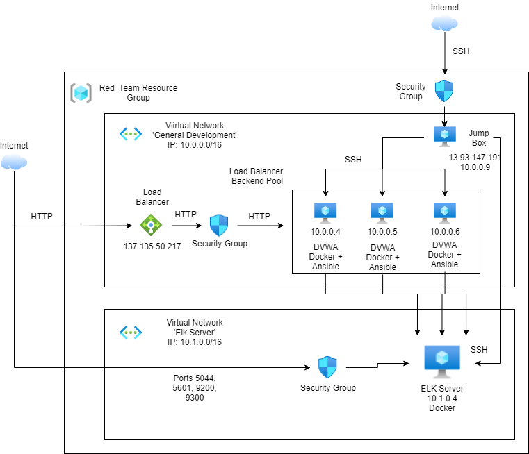
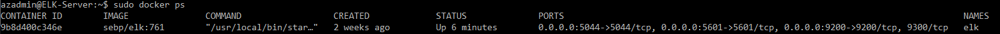

## Automated ELK Stack Deployment

The files in this repository were used to configure the network depicted below.

These files have been tested and used to generate a live ELK deployment on Azure. They can be used to either recreate the entire deployment pictured above. Alternatively, select portions of the yaml file may be used to install only certain pieces of it, such as Filebeat.

  - [Elk Deployment Playbook](./Ansible/Elk_VM_Docker.yml)
  - [Web Docker Playbook](./Ansible/Web_VM_Docker.yml)
  - [Metricbeat Playbook](./Ansible/metricbeat-playbook.yml)
  - [Filebeat Playbook](./Ansible/filebeat-playbook.yml)

This document contains the following details:
- Description of the Topology
- Access Policies
- ELK Configuration
  - Beats in Use
  - Machines Being Monitored
- How to Use the Ansible Build

### Description of the Topology

The main purpose of this network is to expose a load-balanced and monitored instance of DVWA, the D*mn Vulnerable Web Application.

Load balancing ensures that the application will be highly stable, in addition to restricting traffic to the network.
- A Load Balancer provides reduncancy and stablizes the application by spreading the load across different servers.
- A Jump box allows us to set up multiple machines at once with a secure connection

Integrating an ELK server allows users to easily monitor the vulnerable VMs for changes to the network and system logs.
- Filebeat monitors log files and events
- Metricbeat records metrics and statistics of operating system and running services

The configuration details of each machine may be found below.

| Name                 | Function         | IP Address | Operating System |
|----------------------|------------------|------------|------------------|
| Jump-Box-provisioner | Gateway          | 10.0.0.9   | Linux            |
| Web-1                | DVWA Application | 10.0.0.4   | Linux            |
| Web-2                | DVWA Application | 10.0.0.5   | Linux            |
| Web-3                | DVWA Application | 10.0.0.6   | Linux            |
| ELK-Server           | ELK Stack        | 10.1.0.4   | Linux            |

### Access Policies

The machines on the internal network are not exposed to the public Internet. 

Only the Jump-box-provisioner machine can accept connections from the Internet. Access to this machine is only allowed from the following IP addresses:
- 73.189.197.168

Machines within the network can only be accessed directly by ssh, using a key on the ansible jump box container, making the machines secure from the internet

A summary of the access policies in place can be found in the table below.

| Name          | Publicly Accessible | Allowed IP Addresses |
|---------------|---------------------|----------------------|
| Jump Box      | Yes                 | 73.189.197.168       |
| Load Balancer | Yes                 | 73.189.197.168       |
| ELK Server    | Yes                 | 73.189.197.168       |

### Elk Configuration

Ansible was used to automate configuration of the ELK machine. No configuration was performed manually, which is advantageous because...
- Removes work and allows multiple setups at a time

The playbook implements the following tasks:
- Step 1: Allows the linux machine to use more memory for the applications
- Step 2: Installs Docker.io and python module
- Step 3: Downloads and launches the ELK container
- Step 4: Starts the ELK Server

The following screenshot displays the result of running `docker ps` after successfully configuring the ELK instance.

### Target Machines & Beats
This ELK server is configured to monitor the following machines:
- 10.0.0.4
- 10.0.0.5
- 10.0.0.6

We have installed the following Beats on these machines:
- Filebeat
- Metricbeat

These Beats allow us to collect the following information from each machine:
- Filebeat monitors log files and events, such as access logs or login attempts
- Metricbeat records metrics and statistics of operating system and running services

### Using the Playbook
In order to use the playbook, you will need to have an Ansible control node already configured. Assuming you have such a control node provisioned: 

SSH into the control node and follow the steps below:
- Copy the playbook file to the ansible directory.
- Update the hosts file to include the IPs of the target machines
- Run the playbook, and navigate to http://YOURMACHINEIP:5601 to check that the installation worked as expected.

### Kibana Time!
Once you verify that kibana has successfully been installed, you can monitor logs from your machines, or investgate sample data that can be added automatically.